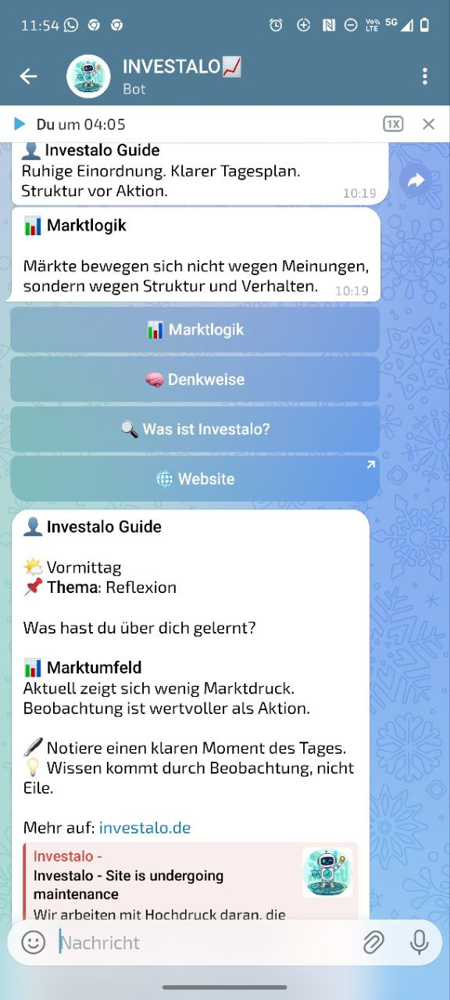

# 🧭 Investalo Telegram-Guide Bot

Ein professioneller Begleiter für Trader, der Struktur und Ruhe in den Handelsalltag bringt. Weg vom "Lärm" der Märkte, hin zu klarer Beobachtung.

## 🚀 Kernfunktionen
- **Automatisierte Marktanalyse:** Scannt via TwelveData API die Volatilität von DAX, S&P 500, Gold und EUR/USD und ordnet das Marktumfeld ein (ruhig/aktiv/unruhig).
- **Interaktives Menü:** Inline-Keyboards für direkten Zugriff auf Marktlogik, Mindset-Themen und Website-Ressourcen.
- **Dynamic Content Engine:** Liefert je nach Tageszeit (Morgen, Mittag, Abend) passende Impulse, Challenges und Reflexionsfragen.
- **Smart Push:** Alle 2 Stunden automatisierte Updates zu Psychologie und Marktkontext.

## 🛠 Tech-Stack
- **Sprache:** Python 3.x
- **Framework:** `python-telegram-bot` (Asynchrone Programmierung)
- **APIs:** TwelveData (Marktdaten), Telegram Bot API
- **Deployment:** Vorbereitet für Server-Umgebungen mit `.env` Support.

## 📦 Installation
1. Repository klonen.
2. `pip install -r requirements.txt` ausführen.
3. `.env.example` in `.env` umbenennen und eigene API-Keys eintragen.
4. `python bot.py` starten.

---
*Entwickelt für die Investalo Akademie – Mentale Klarheit am Markt.*
